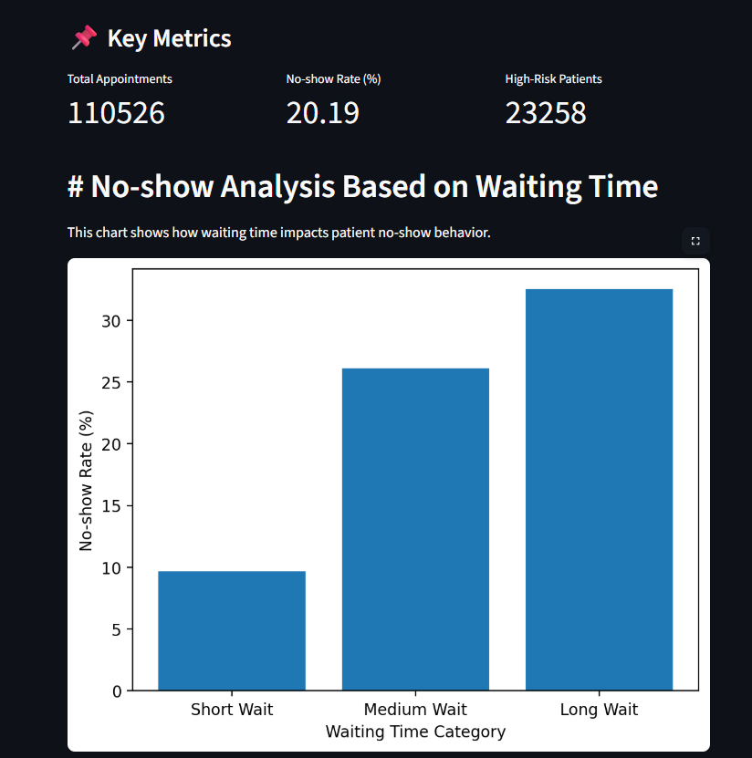

# 🏥 Healthcare Analytics Dashboard

## 📌 Project Overview
This project analyzes patient appointment data to identify patterns in no-show behavior and hospital utilization.

## 🚀 Features
- No-show analysis based on waiting time
- Patient distribution by age group
- High-risk patient behavior analysis
- Interactive dashboard using Streamlit

## 🛠️ Tech Stack
- Python (Pandas, Matplotlib)
- SQL (MySQL)
- Streamlit

## 📊 Key Insights
- Longer waiting times increase no-show rates
- Adults contribute the highest number of appointments
- High-risk patients show distinct attendance behavior

## ▶️ How to Run

1. Clone the repository
2. Install dependencies:
   pip install -r requirements.txt
3. Run the app:
   streamlit run app.py

## 📷 Dashboard Preview
